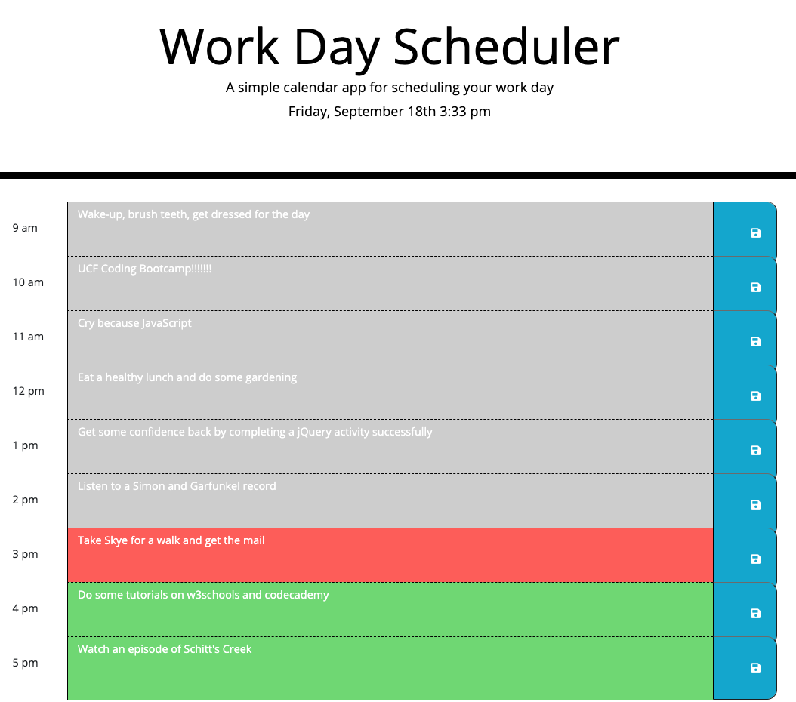

# Work Day Scheduler

## Description
A simple calendar application that allows the user to save events for each hour of the day. This app runs in the browser and features dynamically updated HTML and CSS powered by jQuery.
 #### Github Repository: https://github.com/bridgetrshannon/Work_Day_Scheduler 
#### Github Page: https://bridgetrshannon.github.io/Work_Day_Scheduler/

## Features
- User can enter an event or task
- Save it with the save button
- When page is reloaded, their events or tasks are still displayed
- Users can clear local storage to remove entries the work day scheduler if desired.
 
- The hour blocks change color based on what time it is. Hours that have passed are in grey, the current hour is in red, and future hours are green.
 

